# 🛒 Documentación Completa del Carrito de Compras - Estiloya

## 📋 Índice
1. [Arquitectura General](#arquitectura-general)
2. [Endpoints de la API](#endpoints-de-la-api)
3. [Modelos de Datos](#modelos-de-datos)
4. [Lógica de Negocio](#lógica-de-negocio)
5. [Flujos de Usuario](#flujos-de-usuario)
6. [Validaciones](#validaciones)
7. [Manejo de Errores](#manejo-de-errores)
8. [Integración con UI](#integración-con-ui)

---

## 🏗️ Arquitectura General

### **Patrón de Arquitectura**
```
UI (Activities/Fragments)
    ↓
ViewModel (CarritoViewModel)
    ↓
Repository (CarritoRepository)
    ↓
Service (CarritoService)
    ↓
API Backend (/api/usuario/carrito/*)
```

### **Componentes Principales**
- **CarritoService**: Interface Retrofit para llamadas HTTP
- **CarritoRepository**: Lógica de negocio y validaciones
- **CarritoViewModel**: Gestión de estado y operaciones
- **CarritoActivity**: UI principal del carrito
- **CarritoAdapter**: Adaptador para lista de productos

---

## 🔌 Endpoints de la API

### **Base URL**: `/api/usuario/carrito`

### **1. Obtener Carrito Actual**
```http
GET /api/usuario/carrito
Authorization: Bearer {token}
```

**Respuesta Exitosa (200):**
```json
[
  {
    "id": 1,
    "productoId": 123,
    "nombre": "Camiseta Estiloya",
    "precio": 29.99,
    "cantidad": 2,
    "subtotal": 59.98,
    "imagen": "https://api.estiloya.com/images/camiseta.jpg"
  }
]
```

### **2. Agregar Producto al Carrito**
```http
POST /api/usuario/carrito/agregar
Authorization: Bearer {token}
Content-Type: application/json

{
  "productoId": 123,
  "cantidad": 2
}
```

**Respuesta Exitosa (200):**
```json
{
  "success": true,
  "message": "Producto agregado al carrito",
  "data": [
    {
      "id": 1,
      "productoId": 123,
      "nombre": "Camiseta Estiloya",
      "precio": 29.99,
      "cantidad": 2,
      "subtotal": 59.98,
      "imagen": "https://api.estiloya.com/images/camiseta.jpg"
    }
  ]
}
```

### **3. Actualizar Cantidad**
```http
PUT /api/usuario/carrito/actualizar
Authorization: Bearer {token}
Content-Type: application/json

{
  "productoId": 123,
  "cantidad": 3
}
```

**Respuesta Exitosa (200):**
```json
{
  "success": true,
  "message": "Cantidad actualizada",
  "data": [
    {
      "id": 1,
      "productoId": 123,
      "nombre": "Camiseta Estiloya",
      "precio": 29.99,
      "cantidad": 3,
      "subtotal": 89.97,
      "imagen": "https://api.estiloya.com/images/camiseta.jpg"
    }
  ]
}
```

### **4. Eliminar Producto**
```http
DELETE /api/usuario/carrito/eliminar/{itemId}
Authorization: Bearer {token}
```

**Respuesta Exitosa (200):**
```json
{
  "success": true,
  "message": "Producto eliminado del carrito",
  "data": []
}
```

### **5. Obtener Resumen de Compra**
```http
GET /api/usuario/carrito/resumen
Authorization: Bearer {token}
```

**Respuesta Exitosa (200):**
```json
{
  "success": true,
  "message": "Resumen obtenido",
  "data": {
    "subtotal": 149.95,
    "descuento": 15.00,
    "total": 134.95,
    "cantidadItems": 3
  }
}
```

### **6. Finalizar Compra**
```http
POST /api/usuario/carrito/finalizar
Authorization: Bearer {token}
```

**Respuesta Exitosa (200):**
```json
{
  "success": true,
  "message": "Compra finalizada exitosamente",
  "ordenId": "ORD-2024-001"
}
```

### **7. Obtener Producto por ID (Validación)**
```http
GET /api/usuario/productos/{id}
Authorization: Bearer {token}
```

**Respuesta Exitosa (200):**
```json
{
  "id": 123,
  "nombre": "Camiseta Estiloya",
  "precio": 29.99,
  "stock": 50,
  "imagen": "https://api.estiloya.com/images/camiseta.jpg"
}
```

---

## 📊 Modelos de Datos

### **CarritoItem**
```kotlin
data class CarritoItem(
    val id: Long,                    // ID del item en el carrito
    val productoId: Long,            // ID del producto
    val nombre: String,              // Nombre del producto
    val precio: Double,              // Precio unitario
    val cantidad: Int,               // Cantidad seleccionada
    val subtotal: Double,            // Precio * Cantidad
    val imagen: String               // URL de la imagen
)
```

### **AgregarAlCarritoRequest**
```kotlin
data class AgregarAlCarritoRequest(
    val productoId: Long,            // ID del producto a agregar
    val cantidad: Int                // Cantidad a agregar
)
```

### **ActualizarCantidadRequest**
```kotlin
data class ActualizarCantidadRequest(
    val productoId: Long,            // ID del producto a actualizar
    val cantidad: Int                // Nueva cantidad
)
```

### **CarritoResponse**
```kotlin
data class CarritoResponse(
    val success: Boolean,            // Estado de la operación
    val message: String,             // Mensaje descriptivo
    val data: List<CarritoItem>?     // Lista actualizada del carrito
)
```

### **ResumenCompra**
```kotlin
data class ResumenCompra(
    val subtotal: Double,            // Suma de todos los items
    val descuento: Double,           // Descuento aplicado
    val total: Double,               // Total final
    val cantidadItems: Int           // Número total de items
)
```

### **ResumenCompraResponse**
```kotlin
data class ResumenCompraResponse(
    val success: Boolean,            // Estado de la operación
    val message: String,             // Mensaje descriptivo
    val data: ResumenCompra?         // Datos del resumen
)
```

### **FinalizarCompraResponse**
```kotlin
data class FinalizarCompraResponse(
    val success: Boolean,            // Estado de la operación
    val message: String,             // Mensaje descriptivo
    val ordenId: String?             // ID de la orden generada
)
```

---

## 🧠 Lógica de Negocio

### **1. Agregar Producto al Carrito**

```kotlin
suspend fun agregarProducto(productoId: Long, cantidad: Int): Result<CarritoResponse> {
    // 1. Validar cantidad mínima
    if (cantidad <= 0) {
        return Result.failure(Exception("La cantidad debe ser mayor a 0"))
    }
    
    // 2. Verificar stock disponible
    val producto = obtenerProductoPorId(productoId).getOrNull()
    if (producto != null && producto.stock < cantidad) {
        return Result.failure(Exception("Stock insuficiente. Disponible: ${producto.stock}"))
    }
    
    // 3. Enviar request a API
    val request = AgregarAlCarritoRequest(productoId, cantidad)
    val response = carritoService.agregarProducto(request)
    
    // 4. Procesar respuesta
    if (response.isSuccessful) {
        return Result.success(response.body() ?: CarritoResponse(false, "Respuesta vacía"))
    } else {
        return Result.failure(Exception("Error al agregar producto: ${response.code()}"))
    }
}
```

### **2. Actualizar Cantidad**

```kotlin
suspend fun actualizarCantidad(productoId: Long, cantidad: Int): Result<CarritoResponse> {
    // 1. Si cantidad es 0, eliminar producto
    if (cantidad == 0) {
        return eliminarProductoPorProductoId(productoId)
    }
    
    // 2. Validar cantidad mínima
    if (cantidad < 0) {
        return Result.failure(Exception("La cantidad no puede ser negativa"))
    }
    
    // 3. Verificar stock disponible
    val producto = obtenerProductoPorId(productoId).getOrNull()
    if (producto != null && producto.stock < cantidad) {
        return Result.failure(Exception("Stock insuficiente. Disponible: ${producto.stock}"))
    }
    
    // 4. Enviar request de actualización
    val request = ActualizarCantidadRequest(productoId, cantidad)
    val response = carritoService.actualizarCantidad(request)
    
    // 5. Procesar respuesta
    if (response.isSuccessful) {
        return Result.success(response.body() ?: CarritoResponse(false, "Respuesta vacía"))
    } else {
        return Result.failure(Exception("Error al actualizar cantidad: ${response.code()}"))
    }
}
```

### **3. Eliminar Producto**

```kotlin
suspend fun eliminarProducto(itemId: Long): Result<CarritoResponse> {
    // 1. Enviar request de eliminación
    val response = carritoService.eliminarProducto(itemId)
    
    // 2. Procesar respuesta
    if (response.isSuccessful) {
        return Result.success(response.body() ?: CarritoResponse(false, "Respuesta vacía"))
    } else {
        return Result.failure(Exception("Error al eliminar producto: ${response.code()}"))
    }
}
```

### **4. Vaciar Carrito**

```kotlin
suspend fun vaciarCarrito(): Result<Boolean> {
    // 1. Obtener carrito actual
    val carrito = obtenerCarrito().getOrNull() ?: emptyList()
    var success = true
    
    // 2. Eliminar todos los productos uno por uno
    for (item in carrito) {
        val result = eliminarProducto(item.id)
        if (result.isFailure) {
            success = false
        }
    }
    
    return Result.success(success)
}
```

---

## 🔄 Flujos de Usuario

### **Flujo 1: Agregar Producto al Carrito**

```mermaid
sequenceDiagram
    participant U as Usuario
    participant UI as ProductosActivity
    participant VM as CarritoViewModel
    participant R as CarritoRepository
    participant API as Backend API

    U->>UI: Clic "Agregar al carrito"
    UI->>UI: Mostrar CantidadDialog
    U->>UI: Seleccionar cantidad
    UI->>VM: agregarProducto(productoId, cantidad)
    VM->>R: agregarProducto(productoId, cantidad)
    R->>R: Validar cantidad > 0
    R->>API: GET /productos/{id}
    API-->>R: Datos del producto
    R->>R: Validar stock disponible
    R->>API: POST /carrito/agregar
    API-->>R: Carrito actualizado
    R-->>VM: Result<CarritoResponse>
    VM-->>UI: Actualizar UI
    UI-->>U: Mostrar mensaje de éxito
```



### **Flujo 2: Modificar Cantidad en Carrito**


### **Flujo 3: Finalizar Compra**

```mermaid
sequenceDiagram
    participant U as Usuario
    participant UI as CarritoActivity
    participant VM as CarritoViewModel
    participant R as CarritoRepository
    participant API as Backend API

    U->>UI: Clic "Finalizar Compra"
    UI->>UI: Mostrar diálogo confirmación
    U->>UI: Confirmar compra
    UI->>VM: finalizarCompra()
    VM->>R: finalizarCompra()
    R->>API: POST /carrito/finalizar
    API-->>R: Orden creada
    R-->>VM: Result<FinalizarCompraResponse>
    VM-->>UI: Mostrar mensaje de éxito
    UI->>UI: Limpiar carrito
    UI-->>U: Navegar a confirmación
```



---

## ✅ Validaciones

### **Validaciones de Cantidad**
```kotlin
// Cantidad mínima al agregar
if (cantidad <= 0) {
    return Result.failure(Exception("La cantidad debe ser mayor a 0"))
}

// Cantidad no negativa al actualizar
if (cantidad < 0) {
    return Result.failure(Exception("La cantidad no puede ser negativa"))
}
```

### **Validaciones de Stock**
```kotlin
// Verificar stock disponible
val producto = obtenerProductoPorId(productoId).getOrNull()
if (producto != null && producto.stock < cantidad) {
    return Result.failure(Exception("Stock insuficiente. Disponible: ${producto.stock}"))
}
```

### **Validaciones de Autenticación**
```kotlin
// Verificar token válido
if (!SessionManager.isLoggedIn(context)) {
    return Result.failure(Exception("Usuario no autenticado"))
}
```

### **Validaciones de Red**
```kotlin
// Verificar conexión a internet
if (!isNetworkAvailable(context)) {
    return Result.failure(Exception("Sin conexión a internet"))
}
```

---

## 🚨 Manejo de Errores

### **Tipos de Errores**

1. **Errores de Validación**
   - Cantidad inválida
   - Stock insuficiente
   - Producto no encontrado

2. **Errores de Red**
   - Sin conexión a internet
   - Timeout de conexión
   - Servidor no disponible

3. **Errores de Autenticación**
   - Token expirado
   - Usuario no autenticado
   - Permisos insuficientes

4. **Errores del Servidor**
   - Códigos HTTP 4xx/5xx
   - Respuestas malformadas
   - Errores internos del servidor

### **Estrategia de Manejo**

```kotlin
suspend fun operacionCarrito(): Result<T> = withContext(Dispatchers.IO) {
    try {
        // 1. Validaciones previas
        if (!validarPrecondiciones()) {
            return@withContext Result.failure(Exception("Precondiciones no cumplidas"))
        }
        
        // 2. Llamada a API
        val response = carritoService.operacion()
        
        // 3. Procesar respuesta
        if (response.isSuccessful) {
            val data = response.body()
            if (data != null) {
                Result.success(data)
            } else {
                Result.failure(Exception("Respuesta vacía del servidor"))
            }
        } else {
            // 4. Manejar errores HTTP
            when (response.code()) {
                401 -> Result.failure(Exception("Sesión expirada"))
                403 -> Result.failure(Exception("Acceso denegado"))
                404 -> Result.failure(Exception("Recurso no encontrado"))
                500 -> Result.failure(Exception("Error interno del servidor"))
                else -> Result.failure(Exception("Error ${response.code()}: ${response.message()}"))
            }
        }
    } catch (e: Exception) {
        // 5. Manejar excepciones
        when (e) {
            is UnknownHostException -> Result.failure(Exception("Sin conexión a internet"))
            is SocketTimeoutException -> Result.failure(Exception("Tiempo de espera agotado"))
            else -> Result.failure(e)
        }
    }
}
```

### **Mensajes de Error Amigables**

```kotlin
private fun getErrorMessage(exception: Exception): String {
    return when {
        exception.message?.contains("Stock insuficiente") == true -> 
            "No hay suficientes unidades disponibles"
        exception.message?.contains("Sin conexión") == true -> 
            "Verifica tu conexión a internet"
        exception.message?.contains("Sesión expirada") == true -> 
            "Tu sesión ha expirado. Inicia sesión nuevamente"
        exception.message?.contains("Tiempo de espera") == true -> 
            "La operación tardó demasiado. Intenta nuevamente"
        else -> "Ha ocurrido un error. Intenta nuevamente"
    }
}
```

---

## 🎨 Integración con UI

### **Estados de la UI**

```kotlin
class CarritoViewModel : ViewModel() {
    // Estados observables
    private val _carritoItems = MutableLiveData<List<CarritoItem>>()
    val carritoItems: LiveData<List<CarritoItem>> = _carritoItems
    
    private val _resumenCompra = MutableLiveData<ResumenCompraResponse?>()
    val resumenCompra: LiveData<ResumenCompraResponse?> = _resumenCompra
    
    private val _isLoading = MutableLiveData<Boolean>()
    val isLoading: LiveData<Boolean> = _isLoading
    
    private val _error = MutableLiveData<String?>()
    val error: LiveData<String?> = _error
    
    private val _successMessage = MutableLiveData<String?>()
    val successMessage: LiveData<String?> = _successMessage
}
```

### **Observadores en Activity**

```kotlin
class CarritoActivity : BaseActivity() {
    
    override fun onCreate(savedInstanceState: Bundle?) {
        super.onCreate(savedInstanceState)
        
        // Observar cambios en el carrito
        carritoViewModel.carritoItems.observe(this) { items ->
            if (items.isEmpty()) {
                mostrarCarritoVacio()
            } else {
                mostrarProductos(items)
            }
        }
        
        // Observar resumen de compra
        carritoViewModel.resumenCompra.observe(this) { resumen ->
            resumen?.data?.let { actualizarResumen(it) }
        }
        
        // Observar estado de carga
        carritoViewModel.isLoading.observe(this) { isLoading ->
            if (isLoading) {
                mostrarLoading()
            } else {
                ocultarLoading()
            }
        }
        
        // Observar errores
        carritoViewModel.error.observe(this) { error ->
            error?.let { mostrarError(it) }
        }
        
        // Observar mensajes de éxito
        carritoViewModel.successMessage.observe(this) { message ->
            message?.let { mostrarExito(it) }
        }
    }
}
```

### **Adaptador del Carrito**

```kotlin
class CarritoAdapter(
    private val onCantidadChanged: (Long, Int) -> Unit,
    private val onEliminar: (Long) -> Unit
) : RecyclerView.Adapter<CarritoAdapter.ViewHolder>() {
    
    private var items: List<CarritoItem> = emptyList()
    
    fun updateItems(newItems: List<CarritoItem>) {
        items = newItems
        notifyDataSetChanged()
    }
    
    inner class ViewHolder(private val binding: ItemCarritoBinding) : RecyclerView.ViewHolder(binding.root) {
        
        fun bind(item: CarritoItem) {
            // Configurar datos del item
            binding.tvNombreProducto.text = item.nombre
            binding.tvPrecio.text = "$${item.precio}"
            binding.tvCantidad.text = item.cantidad.toString()
            binding.tvSubtotal.text = "$${item.subtotal}"
            
            // Configurar controles de cantidad
            binding.btnMenos.setOnClickListener {
                val nuevaCantidad = item.cantidad - 1
                onCantidadChanged(item.productoId, nuevaCantidad)
            }
            
            binding.btnMas.setOnClickListener {
                val nuevaCantidad = item.cantidad + 1
                onCantidadChanged(item.productoId, nuevaCantidad)
            }
            
            // Configurar botón eliminar
            binding.btnEliminar.setOnClickListener {
                onEliminar(item.id)
            }
        }
    }
}
```

---

## 📱 Características Especiales

### **Badge del Carrito**
- Contador de items en tiempo real
- Actualización automática al agregar/eliminar
- Integración con menú de navegación

### **Diálogo de Cantidad**
- Validación de stock en tiempo real
- Cálculo de subtotal dinámico
- Controles intuitivos (+/-)

### **Estados Vacíos**
- Mensaje amigable cuando el carrito está vacío
- Botón para navegar a productos
- Ilustración descriptiva

### **Confirmaciones**
- Diálogo antes de eliminar productos
- Confirmación antes de finalizar compra
- Feedback visual de acciones

### **Optimizaciones**
- Debounce en actualizaciones de cantidad
- Caché local del carrito
- Actualizaciones optimistas de UI
- Lazy loading de imágenes

---

## 🔧 Configuración Técnica

### **Dependencias Requeridas**
```gradle
dependencies {
    // Retrofit para API calls
    implementation 'com.squareup.retrofit2:retrofit:2.9.0'
    implementation 'com.squareup.retrofit2:converter-gson:2.9.0'
    
    // Coroutines para operaciones asíncronas
    implementation 'org.jetbrains.kotlinx:kotlinx-coroutines-android:1.6.4'
    
    // ViewModel y LiveData
    implementation 'androidx.lifecycle:lifecycle-viewmodel-ktx:2.6.1'
    implementation 'androidx.lifecycle:lifecycle-livedata-ktx:2.6.1'
    
    // Glide para imágenes
    implementation 'com.github.bumptech.glide:glide:4.15.1'
}
```

### **Configuración de Retrofit**
```kotlin
object ApiClient {
    fun createCarritoService(context: Context): CarritoService {
        val retrofit = Retrofit.Builder()
            .baseUrl("https://api.estiloya.com/")
            .addConverterFactory(GsonConverterFactory.create())
            .client(createOkHttpClient(context))
            .build()
        
        return retrofit.create(CarritoService::class.java)
    }
    
    private fun createOkHttpClient(context: Context): OkHttpClient {
        return OkHttpClient.Builder()
            .addInterceptor(AuthInterceptor(context))
            .connectTimeout(30, TimeUnit.SECONDS)
            .readTimeout(30, TimeUnit.SECONDS)
            .build()
    }
}
```

---

## 📊 Métricas y Analytics

### **Eventos Rastreados**
- Agregar producto al carrito
- Actualizar cantidad
- Eliminar producto
- Finalizar compra
- Abandono del carrito

### **Métricas Clave**
- Tasa de conversión del carrito
- Tiempo promedio en el carrito
- Productos más agregados
- Valor promedio del carrito
- Tasa de abandono

---

## 🚀 Consideraciones de Rendimiento

### **Optimizaciones Implementadas**
1. **Debounce en actualizaciones**: Evita múltiples requests al cambiar cantidad
2. **Caché local**: Almacena carrito en memoria para acceso rápido
3. **Lazy loading**: Carga imágenes solo cuando son visibles
4. **Actualizaciones optimistas**: Actualiza UI inmediatamente, valida después

### **Monitoreo**
- Tiempo de respuesta de API
- Uso de memoria
- Tiempo de carga de imágenes
- Errores de red

---

## 🔒 Seguridad

### **Medidas Implementadas**
1. **Autenticación**: Token Bearer en todas las requests
2. **Validación de entrada**: Sanitización de datos
3. **HTTPS**: Todas las comunicaciones cifradas
4. **Rate limiting**: Protección contra spam
5. **Validación de stock**: Previene overselling

---

## 📝 Notas de Implementación

### **Decisiones de Diseño**
1. **Repository Pattern**: Separación clara de responsabilidades
2. **Result Pattern**: Manejo consistente de errores
3. **LiveData**: Reactividad en la UI
4. **Coroutines**: Operaciones asíncronas eficientes

### **Consideraciones Futuras**
1. **Sincronización offline**: Guardar carrito localmente
2. **Push notifications**: Notificar cambios de stock
3. **Wishlist**: Lista de deseos integrada
4. **Recomendaciones**: Productos sugeridos

---

*Documentación generada para Estiloya - Sistema de Carrito de Compras*
*Versión: 1.0 | Fecha: 2024* 